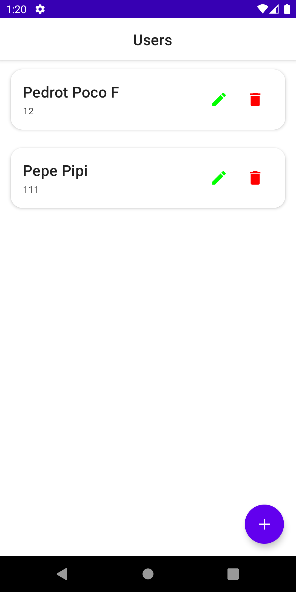
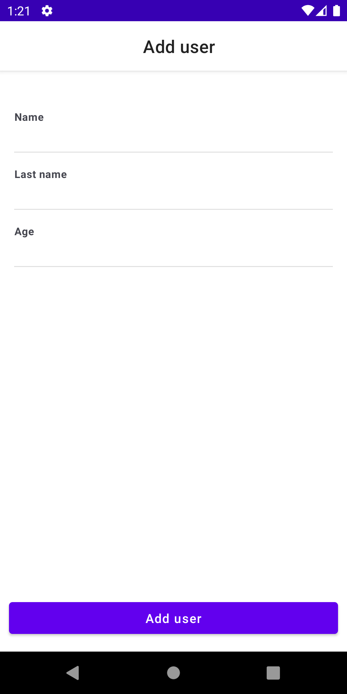
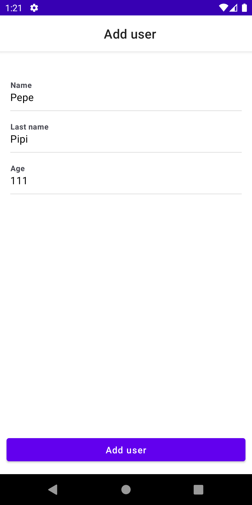

# People App

## Description:

Android application developed in the Kotlin language. It consists in a CRUD (Create, Read, Update, Delete) of people. The data will be stored locally. 
The main page shows the list of people created.
To create a person it is necessary to press the bottom button and give name, lastname and age in the fields.
Clicking the pencil button on each person will let edit that person information.
To delete a person just click the trash can button.

## Features:

- Room
- Jetpack Compose
- Jetpack Viewmodel
- MVVM
- Clean Architecture
- Coroutines
- Dagger Hilt

# Screens

## List of people

## Add person

## Edit person

